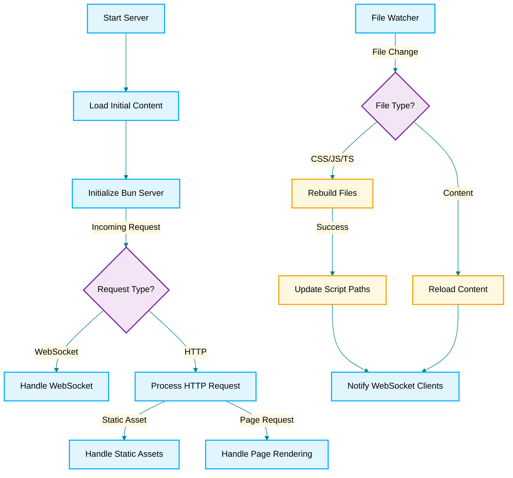

# Baseline & Animation

This is a demo of baseline types & animation

To install dependencies:

```bash
bun install
```

To run:

```bash
bun start
```

## Environments

| Environment | Link                                      |
| ----------- | ----------------------------------------- |
| Live        | [Live](https://baseline.gotpop.co)        |
| Local       | [Local](http://localhost:2000)            |
| Railway     | [Railway](https://railway.app/dashboard)  |
| Cloudflare  | [Cloudflare](https://dash.cloudflare.com) |

## Stack

This project was created using `bun init` in bun v1.0.23. [Bun](https://bun.sh) is a fast all-in-one JavaScript runtime.

To install dependencies:

```bash
bun install
```

To run:

```bash
bun start
```

This project was created using `bun init` in bun v1.34. [Bun](https://bun.sh) is a fast all-in-one JavaScript runtime.


