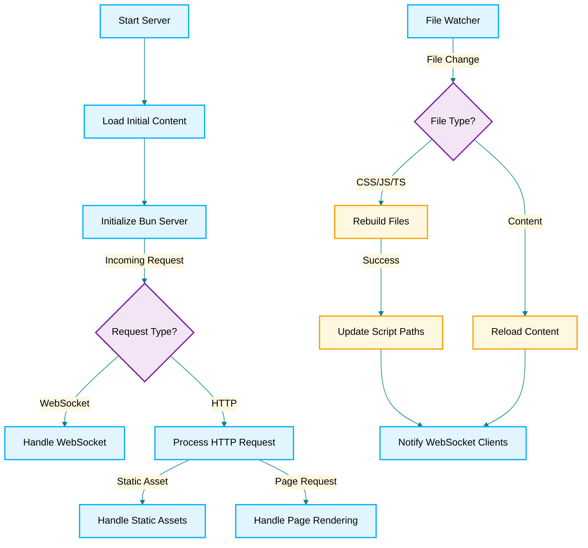

# Baseline & Animation

A demonstration project showcasing baseline types & animation capabilities using Bun runtime.

## Overview

This project demonstrates the use of Bun runtime for creating a fast and efficient server-side application with baseline types and animation capabilities. It includes various environments for deployment and a detailed technical architecture.

## Quick Start

To get started with the project:

To install dependencies:

```bash
bun install
```

To run:

```bash
bun start
```

## Environments

| Environment | Link                                      |
| ----------- | ----------------------------------------- |
| Live        | [Live](https://baseline.gotpop.co)        |
| Local       | [Local](http://localhost:2000)            |
| Railway     | [Railway](https://railway.app/dashboard)  |
| Cloudflare  | [Cloudflare](https://dash.cloudflare.com) |

## Technical Architecture

This project was created using `bun init` in bun v1.0.23. [Bun](https://bun.sh) is a fast all-in-one JavaScript runtime.



## File Structure

The project structure is as follows:

```
baseline-animation/
├── src/
│   ├── index.ts
│   ├── components/
│   ├── styles/
│   └── utils/
├── public/
│   ├── index.html
│   └── assets/
├── bun.lockb
├── package.json
└── README.md
```

## Development Workflow

1. Clone the repository
2. Install dependencies using `bun install`
3. Start the development server using `bun start`
4. Make changes and see them reflected in real-time

## Performance

Bun runtime is designed for performance, with fast startup times and efficient handling of server-side tasks. This project leverages these capabilities to provide a smooth and responsive experience.

## Contributing

We welcome contributions! Please follow these steps to contribute:

1. Fork the repository
2. Create a new branch (`git checkout -b feature-branch`)
3. Make your changes
4. Commit your changes (`git commit -m 'Add some feature'`)
5. Push to the branch (`git push origin feature-branch`)
6. Open a pull request

## License

This project is licensed under the MIT License. See the [LICENSE](LICENSE) file for details.